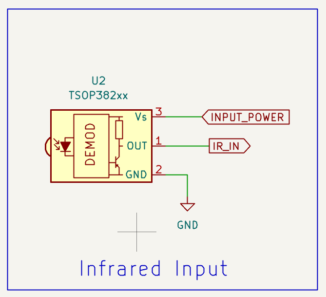

# MicroPython TV-B-Gone clone
## Introduction
This is a MicroPython implementation of the TV-B-Gone project.
The [TV-B-Gone](https://www.tvbgone.com/) (by Mitch Altman) is a universal remote control that can turn off most televisions.
Unfortunately, the existing open-source implementations (for the ATTiny microcontrollers) have very outdated code databases and don't work with many modern TVs.
This project is designed to work with the ESP32 microcontroller and a recent version of MicroPython (I used v1.25.0).
I wanted to use the ESP32 because its RMT peripheral allows for simple and well controlled modulated IR signal generation.
## Testing status
Currently this code has been tested and works fine with ESP32-S3 boards.
I am currently using an Unexpected Maker TinyS3.
I started with a XIAO ESP32-C6 board, but found that the `deepsleep()` had issues.
## Development Workflow
I didn't want to spend lots of time editing codes, so I bought a [very cheap IR universal remote control from Amazon](https://www.amazon.com/dp/B0D6GFNFJY).
I asked Google Gemini to tell me the top 10 brands of modern TVs and collected the power-toggle codes for every code given in my universal remote manual for the 10 brands, using an IR receiver module connected to my Saleae Logic 8 logic analyzer.
Saleae's automation API and Python helped me automate the collection process.
Then I had the Cody AI write a Python script that could read the CSV files produced by the Saleae logic analyzer and convert them into a format that could be used by the ESP32. Along the way I also had it identify the IR protocols, and also produce hex representations of the codes for recognized protocols, to allow me to eliminate duplicate codes.
## TV Brands Supported
The following brands are supported:
  - Samsung
  - LG
  - TCL
  - Hisense
  - Sony
  - Vizio
  - Panasonic
  - Philips
  - Sharp
  - Toshiba
## Installation and usage
Copy all the files from the `firmware` directory to your ESP32's root directory.
After a reset, the ESP32 will send all the codes and will go into deep sleep until the button is pressed.
When the button is pressed, the ESP32 will wake up and start sending IR codes.
## Capturing new codes
If you want to capture new codes, get into the MicroPython REPL and hit Ctrl-C in the 3 seconds after the codes are sent.
After you have quit capturing codes, the ESP32 will will be ready to send the codes you entered
the next time you push the button.
## Code structure
The representation of each of the codes in `firmware/codes.py` is a tuple with periods in microseconds. Each code may have an optional name as a string as the first member of the tuple.
I used the universal remote's own code numbers as the names.
This is the same representation as the captured codes in the `captured` directory.
## Configuration
See [`firmware/config.py`](firmware/config.py) for the configuration options.
### Circuit-related configuration
  - `OUTPUT_PIN` is the GPIO pin used for the IR LED.
  - `ACTIVE_LEVEL` is the level that the output pin will be set to when the IR LED is active. For an output circuit that uses an NPN or NMOS transistor, this should usually be 1 (high).
  - `BUTTON_PIN` is the GPIO pin used for the button. I used the GPIO that is connected to the `BOOT` button on my development board. This pin should be one of the GPIO pins that is connected to the RTC and can be used for deep sleep wakeup.
  - `BUTTON_ACTIVE_LEVEL` is the level that the button pin will be set to when the button is pressed. I used 0 (low) for my circuit, but some circuits may require a high level.
  - `BUTTON_PULL` is the pull-up or pull-down setting (if any) to use for the button pin. This can be `None`, `Pin.PULL_UP`, or `Pin.PULL_DOWN`.
  - `RGB_LED_PIN` is the GPIO pin used for the RGB LED. I used GPIO 48, because it was connected to the onboard RGB LED on my development board. If you don't have an RGB LED, you can set this to `None` to disable the RGB LED.
  - `RGB_LED_POWER_PIN` is the GPIO pin used to power the RGB LED, if any. This is used on the TinyS3. Use `None` if you don't have such a power pin.
  - `USER_LED_PIN` is the GPIO pin used for the monochrome LED. If you don't have a monochrome LED, you can set this to `None` to disable the monochrome LED.
  - `USER_LED_ACTIVE_LEVEL` is the level that the monochrome LED pin should be set to to turn the LED is on.
  - `DUTY_CYCLE` is the duty cycle to use for the IR LED.
  This is the percentage of time that the IR LED will be on during the 38kHz pulses.
  I used 25% for my circuit, but numbers from 10% to 50% should work. 25% is a good starting point.
  - `INPUT_PIN` is the (optional) GPIO pin used for the IR receiver module. I used GPIO 4, but you can use any GPIO pin that is not used for other purposes.
  - `INPUT_ACTIVE_LEVEL` is the level that the input pin will be set to when the IR receiver is receiving a signal. This is usually 0.
  - `INPUT_POWER_PIN` is the (optional) GPIO pin used to power the IR receiver module (instead of just connecting it to 3.3V).
  `None` means the IR receiver is not used or is powered from 3.3V.
  - `USE_XAIO_ESP32C6` is a boolean that determines whether to use the XIAO ESP32-C6 board as the default for ESP32-C6 builds.
  If you have a different ESP32-C6 board, you should set this to `False`.
  
You can also edit the RGB LED colors in `firmware/config.py` if you want different colors.
## Transmitter Circuit Design
You will need a 940nm IR LED and a simple one-transistor driver circuit to drive the LED.
See Peter Hinch's explanation [here](https://github.com/peterhinch/micropython_ir/blob/master/TRANSMITTER.md).
Although Peter's examples show an NPN BJT transistor, 
I used a BS170 N-channel MOSFET transistor because that's what I had on hand, but any logic-level N-channel MOSFET should work.
The IR LED's cathode is connected to the drain of the transistor,
and its anode is connected in series with a current limiting resistor whose other end is connected to your highest-voltage power rail (I used +5V on the dev board, and VBAT on the portable device).
The MOSFET's source is connected to ground, and its gate is connected to the GPIO pin used for the IR LED.
Note that if you are using a battery, the voltage will probably be lower than 5V, so you may need to adjust the resistor value accordingly.
Also the IR output will be reduced as the battery voltage drops if you use a simple one-transistor circuit with no provisions for constant-current output.
The value of the current limiting resistor depends on the power supply voltage and the IR LED's maximum pulse current rating.
Figure the resistor value using Ohm's law: R = (Vsupply - Vled - Vsat) / Iled.
Vled is the forward voltage drop of the IR LED (typically around 1.2-1.5V),
Vsat is the saturation voltage of the transistor (typically around 0.1V for an NPN), and Iled is the desired current through the IR LED.
If you're using a MOSFET, Vsat would be Iled*Rds(on), where Rds(on) is the on-resistance of the MOSFET.
I used a high-power IR LED with a maximum pulse current rating of 200mA (TSAL6200), so I used a 22 ohm resistor to produce 100mA current pulses at 3.6V.

## Receiver Circuit Design
You will need an IR receiver module.
I used a 38kHz TSOP38238 IR receiver module, which is a common and cheap module.
Connect its power supply to +3.3V (or to `INPUT_POWER_PIN` if you are using one) and its ground to GND.
Connect its output pin to the `INPUT_PIN` GPIO on your ESP32.

## Files in this repository
  - [`analyze_signal.py`](analyze_signal.py): Analyzes a recorded IR signal and prints the results (mostly written by the Cody AI).
  - [`capture_saleae.py`](capture_saleae.py): Captures IR signals using Saleae Logic 2 and saves the data to a CSV file.
  - [`prompt_captures.py`](prompt_captures.py): A script to capture IR codes using the Saleae and save them to CSV files.
  - [`firmware/config.py`](firmware/config.py): Configuration file for the firmware.
  - [`firmware/codes.py`](firmware/codes.py): IR codes for the ESP32.
  - [`firmware/main.py`](firmware/main.py): Main firmware file.
  - [`firmware/capture.py`](firmware/capture.py): Captures IR codes using the ESP32 and saves them to a Python file.
  - [`firmware/leds.py`](firmware/leds.py): RGB and monochrome LED control code.
  - [`firmware/xiao_esp32c6.py`](firmware/xiao_esp32c6.py): Seeed Studio XIAO ESP32-C6 board support.
  - [`firmware/code_compare.py`](firmware/code_compare.py): Compares all the IR codes and prints similar pairs.
  - `good/`: CSV files of good (non-duplicated) IR codes captured using the Saleae Logic.
  - `good_py/`: Good IR codes captured using the Saleae Logic, converted to Python format.
  - `README.md`: This file.
  - [`docs/irmp_protocols.csv`](docs/irmp_protocols.csv): A CSV file with details of IR protocols supported by the IRMP library.
  - [`hardware/`](hardware/): Hardware design files.
## External references
  - [TV-B-Gone](https://www.tvbgone.com/)
  - [MicroPython IR library](https://github.com/peterhinch/micropython_ir/)
  - [IRMP project](https://github.com/IRMP-org/IRMP)
  - [Ken Shirrif's Arduino TV-B-Gone](https://github.com/shirriff/Arduino-TV-B-Gone)
  - [Adafruit's TV-B-Gone kit](https://github.com/adafruit/TV-B-Gone-kit)
